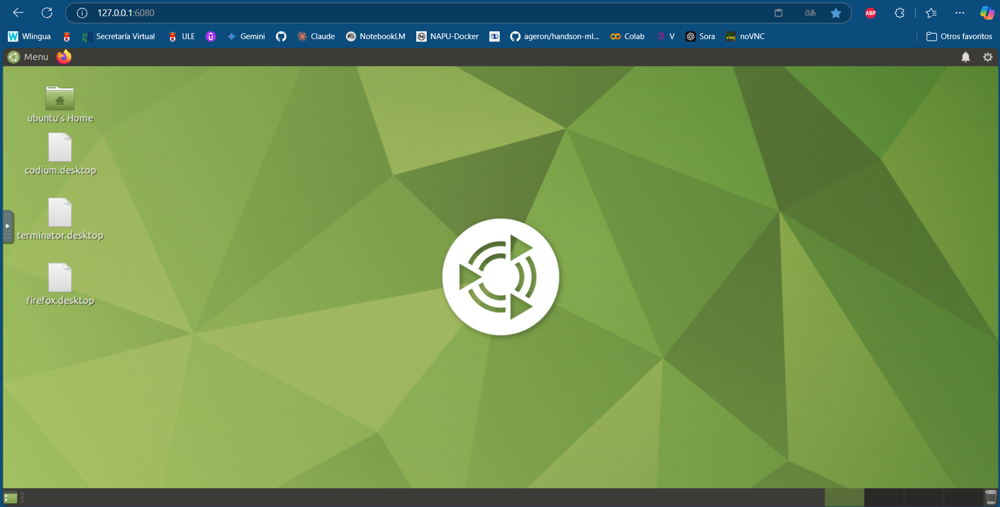
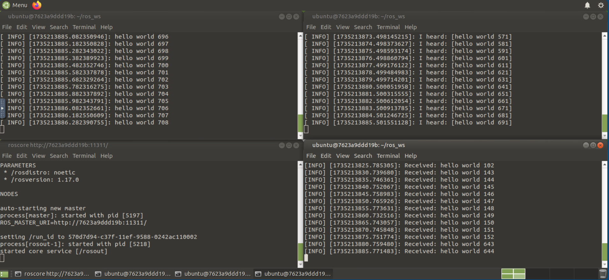
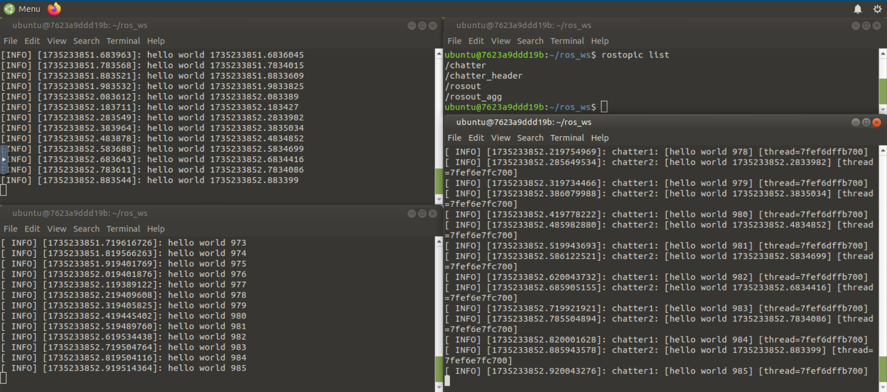
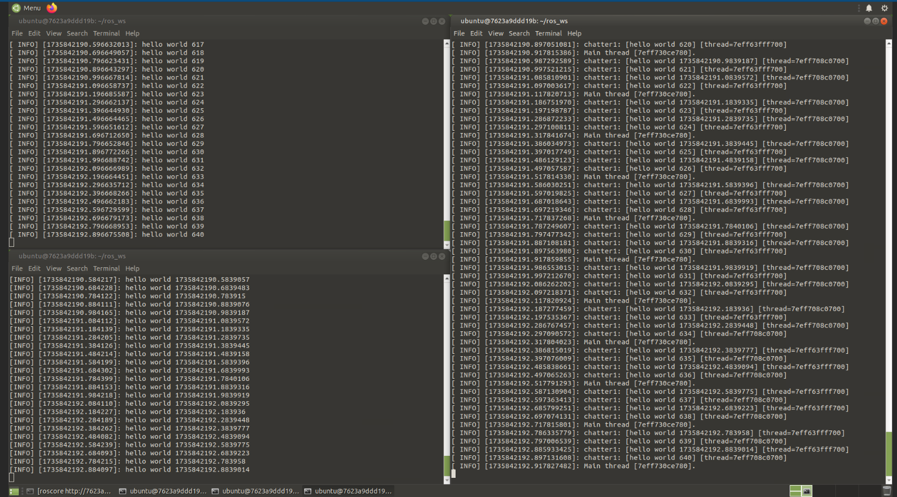
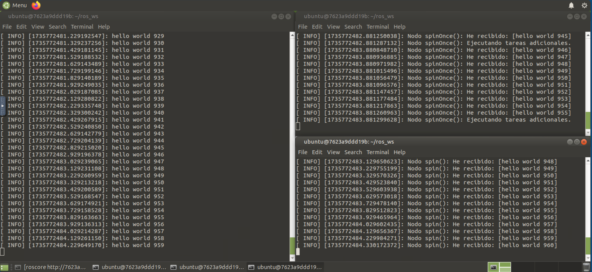
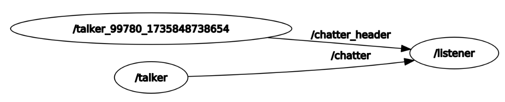

# ROS - NOETIC

[Docker](#docker) <br>
[Ejercicio 1 - Publicador y Suscriptor básico con colas de topic](#ejercicio-1---publicador-y-suscriptor-básico-con-colas-de-topic) <br>
[Ejercicio 2 - Gestión multihilo con spin en Python y C++](#ejercicio-2---gestión-multihilo-con-spin-en-python-y-c) <br>
[Ejercicio 3 - Comparacion entre spinOnce() y spin()](#ejercicio-3---comparacion-entre-spinonce-y-spin) <br>
[Ejercicio 4 - Manejo de Sobrecarga en un Sistema Multihilo](#ejercicio-4---manejo-de-sobrecarga-en-un-sistema-multihilo)

## Docker
Se crea un volumen:
```powershell
docker volume create midd_ros
```
Se lanza el contenedor:
```powershell
docker run -p 6080:80 --shm-size=512m --name midd_ros -v midd_ros:/root/midd_ros tiryoh/ros-desktop-vnc:noetic
```
Para usar desde el navegador: (http://127.0.0.1:6080/) 



<strong style="color: red;">Importante</strong>
 recordar como se compila en ros. Además, despues de sourcear, es necesario levantar el nodo maestro con `roscore`.

```bash
# 0 Terminal
catkin_make
source devel/setup.bash
roscore
```

## Ejercicio 1 - Publicador y Suscriptor básico con colas de topic
En este primer ejercicio se crean nodos *publish* y *subscribe* en Python y C++. Además, se ajusta la cola del suscriptor `queue_size`  y se añaden `sleep` para realentizar el procesamiento de mensajes.



Podemos ver con este ejemplo como la publicación de lectura de los mensajes por parte del *subscribe* está realentizada por culpa de los *sleep*. Con el listener de python, perdemos más mensages que con c++.

Comandos para ejecutar nuestros talker y nuestros subscribe
```bash
# 1 Terminal:
rosrun roscpp_tutorials talker
# 2 Terminal:
rosrun roscpp_tutorials listener
# 3 Terminal:
rosrun rospy_tutorials listener
```

<strong style="color: red;">Importante</strong>
: Se ha modificado el talker de Python para ser usado en el siguiente ejercicio. Le hemos cambiado el nombre del topic donde publica a `chatter_header`.

**Conclusión:** 

En este ejercicio hemos podido ver como afecta el tamaño de las colas en el flujo de datos entre el publicador y el suscriptor en ROS. Se ha comprobado como el tamaño de la cola y el lenguaje de programación son factores que determinan la eficiencia y eficacia de la comunicación entre los nodos. Además, el hecho de usar sleep en los nodos sucriptores hace que perdamos información al ser procesados por estos nodos.

## Ejercicio 2 - Gestión multihilo con spin en Python y C++
Tenemos que lanzar los talker de C++ y de Python (lo hemos modificado para que publique con el nombre de chatter_header).

Compilamos los paquetes y ejecutamos master en una terminal:
```bash
# 0 Terminal:
cd ros_ws
catkin_make
source devel/setup.bash
roscore
```

```bash
cd ..
cd ros_ws
# 1 Terminal:
rosrun roscpp_tutorials talker
# 2 Terminal:
rosrun rospy_tutorials talker
# 3 Terminal:
rosrun roscpp_tutorials listener_threaded_spin # MultiThreadedSpinne
rosrun roscpp_tutorials listener_async_spin # AsyncSpinner
```
Para el correcto desarrollo de esta práctica, se crea un nodo en C que se suscribe a los `publisher talker` simultaneamente, empleando `spinner multihilo`. En la imagen se puede apreciar como el nodo procesa los callbacks sin bloquearse. 


Además, se usa el `asyncSpinner()`.



**Conclusión:**

Ambos métodos sirven para procesar `callbacks`. `MultiThreadedSpinner` crea un número fijo de hilos para trabaajr en paralelo, en nuestro caso 2 (suele bloquear el hilo principal). Sin embargo, `AsyncSpinner` inicia sus propios hilos de manera asíncrona y no necesita bloquear el hilo principal, por lo que el programa principal puede seguir haciendo otras cosas mientras los hilos procesan los callbacks en segundo plano. 

Cabe destacar que la función `AsyncSpinner()` en Python es diferente a estos dos métodos ya vistos en C++, pero se aproxima más a la funcionalidad del método `MultiThreadedSpinner()` de C++. Con la ventaga de eficiencia que supone usar C.

## Ejercicio 3 - Comparacion entre spinOnce() y spin()

Compilamos los paquetes y ejecutamos master en una terminal:
```bash
# 0 Terminal
cd ros_ws
catkin_make
source devel/setup.bash
roscore
```

Abrimos 3 terminales más y ejecutamos en cada una de ellos nuestros nodos:
```bash
# 1 Terminal:
rosrun roscpp_tutorials talker
# 2 Terminal:
rosrun roscpp_tutorials spinOne
# 3 Terminal:
rosrun roscpp_tutorials spin
```

Los resultados obtenidos:



**Conclusión:**

En esta práctica se abordan dos enfoques en c++: `ros::spin()` y`ros::spinOne()`. Ambos enfoques tienen sus ventajas y son adecuados para diferentes escenarios.

- `ros::spin()` Ideal para nodos que son principalmente reactivos y no requieren realizar otras operaciones concurrentes. Ofrece simplicidad y eficiencia en el manejo de callbacks
- `ros::spinOne()` Adecuado para nodos que necesitan realizar múltiples tareas, combinando el manejo de callbacks con otras operaciones dentro de un ciclo de ejecución controlado. Proporciona flexibilidad a costa de una mayor complejidad y consumo de recursos.

## Ejercicio 4 - Manejo de Sobrecarga en un Sistema Multihilo

```bash
# 0 Terminal
cd ros_ws
catkin_make
source devel/setup.bash
roscore
```

```bash
cd ..
cd ros_ws
# 1 Terminal:
rosrun roscpp_tutorials talker
# 2 Terminal:
rosrun rospy_tutorials talker
# 3 Terminal:
rosrun roscpp_tutorials listener_threaded_spin
# 4 Terminal
rosparam set /enable_statistics true # despues de iniciar se ejecutan los nodos y despues:
rostopic echo /statistics
```

En este ejercicio si ejecutamos la herramienta de `rqt_graph` podemos ver el flujo de información entre los nodos. El *publisher* en python es el `talker_` y el de C++ es `talker`. Cada uno publica en un topic diferente al que se suscribe el `listener`, que es nuestro código MultiThreadedSpinner en C++. 



Para nuestras pruebas, el tamaño de cola de los *talker* es de 100 y la frecuencia de publicación es de 100 para ambos nodos. Además, el callback1 (procesa el topic `chatter`) simula una tarea que tarda 0.1 segundos en completarse, mientras que el callback2 procesa los mensajes mucho más rápido. El tamaño de la cola se ajusta a 100 inicialmente. Hemos realizado diferentes pruebas tal y como se adjuntan en las imagenes que exponemos a continuación. 


En esta primera imagen, podemos ver como se pierden mensajes del orden de 90 para para ambos topics `chatter` y `chatter_header`. Esto es coherente pues tenemos un único hilo procesando el flujo de información.

Para reducir esta pérdida de información, se propone aumentar el número de hilos a dos hilos. Podemos ver en la siguiente imagen como conseguimos reducir significativamente la pérdida de mensajes con el nodo publicador `talker_`. Sin embargo, el número de información que perdemos por el otro nodo publicador permanece invariante. 


Aumentamos de nuevo el numero de hilos y no obtenemos cambio alguno, esto es coherente pues la limitación viene dada por las colas tanto del publisher como del suscriber. El la siguiente imagen, no se obtiene mejoría alguna.


Entonces, proponemos de nuevo una solución. Aumentar el tamaño de las colas a 10.000 para el nodo de Pyhton y en el nodo que se suscribe al topic que publica el nodo de Python. Reducimos así, por completo la pequeña información que perdíamos del nodo `talker`


Se puede ver como a medida que aumenta el numero de hilos y el tamaño de las colas, la desviación estandar del tiempo entre publicaciones aumenta (`period_stddev`). Además, a lo largo del procedimiento, hemos visto como el numero de mensajes descartados por razon de cola y de hilos, se ha ido solventando paulatinamente. Un sistema multihilo bien configurado puede manejar una alta acrga de datos, mejorar las estabilidad y el rendimiento de los nodso en ROS. Las herramientas `rqt_graph`, `rosbag`, `topic_tools throttle` y `statistics` nos permiten obtener una exaustiva evaluación del rendimiento y las limitaciones del sistema multihilo en ROS.

La herramienta statistics es muy útil, por lo que vamos a hacer notar el significado de cada uno de sus métricas:

- **topic**: El nombre del topic monitoreado (ejemplo: `/chatter`).
- **node_pub**: Nodo que publica los mensajes (ejemplo: `/talker`).
- **node_sub**: Nodo que suscribe a los mensajes (ejemplo: `/listener`).
- **delivered_msgs**: Número de mensajes entregados con éxito al suscriptor.
- **dropped_msgs**: Número de mensajes descartados (por ejemplo, si la cola del suscriptor estaba llena).
- **traffic**: Cantidad total de datos transferidos (en bytes).
- **period_mean**: Tiempo promedio entre publicaciones.
- **period_stddev**: Desviación estándar del tiempo entre publicaciones.
- **stamp_age_mean**: Latencia promedio desde que el mensaje fue publicado hasta que fue procesado.