# ROS2 HUMBLE

[Docker](#docker) <br>
[Ejercicio 1 - Publicación y Suscripción en ROS 2](#ejercicio-1---publicación-y-suscripción-en-ros-2) <br>
[Ejercicio 2 - Suscripción a Topics en ROS 2 desde la Línea de Comandos (CLI)](#ejercicio-2---suscripción-a-topics-en-ros-2-desde-la-línea-de-comandos-cli) <br>
[Ejercicio 3 - Gestión de Concurrencia y Callbacks en ROS ](#ejercicio-3---gestión-de-concurrencia-y-callbacks-en-ros) <br>
[Ejercicio 4 - Creación de un Servicio en ROS 2 para Contar Vocales](#ejercicio-4---creación-de-un-servicio-en-ros-2-para-contar-vocales)

## Docker
Se crea un volumen:
```powershell
docker volume create midd_ros2
```
Se lanza el dontenedor:
```powershell
docker run -p 6080:80 --shm-size=512m --name midd_ros2 `
  -v midd_ros2:/root/midd_ros2 `
  tiryoh/ros2-desktop-vnc:humble
```
Para usar desde el navegador: (http://127.0.0.1:6080/) 


Durante todo el desarrollo clonamos el repositorio de referencia: https://github.com/ros2/examples

```bash
cd ros2_ws/src
git clone https://github.com/ros2/examples
```

<span style="color:red;">IMPORTANTE:</span> En ROS2, a diferencia de ROS1, no tenemos Máster, por lo que es suficiente compilar con `colcon build`. Además, para sourcear: `source install/setup.bash`.

Cabe destacar que todos los códigos se encuentran dentro del directorio paquetes.

## Ejercicio 1 - Publicación y Suscripción en ROS 2

Como la evolución de los ejericios se desarrolla en Python, excepto para situaciones aisladas, se genera un archivo `COLCON_IGNORE` sobre los directorios de `rclcpp`, `launch_testing`, entre otros. De este modo, como estamos empleando docker, optimizamos nuestros recursos al no compilar el resto de paquetes.

### Ejercicio 1 y 2: Implementación de un publicador y suscriptor mínimo
Para la implementación del publicador y suscriptor mínimo, hemos reutilizado el código de examples de `publisher/subscriber_old_school.py` satisfaciendo las condiciones del enunciado. Los resultados obtenidos:

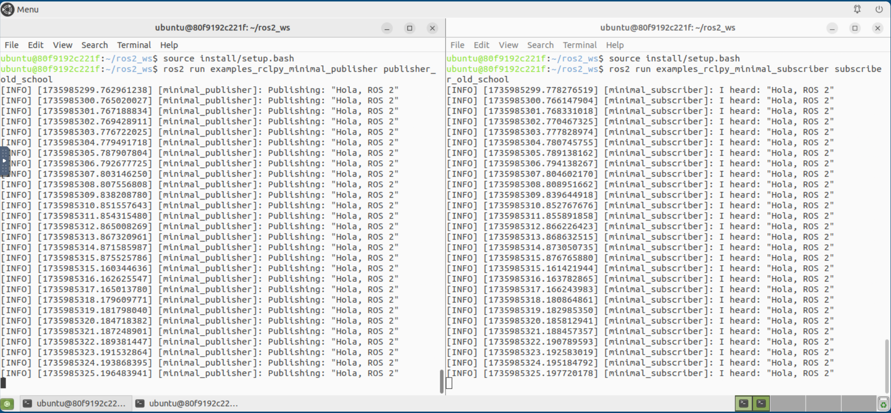
### Ejercicio 3: Publicador y suscriptor con mensajes personalizados
En este ejemplo, hemos personalizado un paquete custom en Python `custom_msgs_pkg` con un nodo publisher y subscriber; que satisfacen las condicones del enunciado. Para crear el paquete hemos empleado el comando:

```bash
ros2 pkg create custom_msgs_pkg --build-type ament_python --dependencies rclpy std_msgs
```

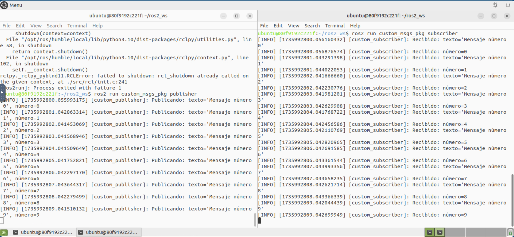
### Ejercicio 4: Publicador con temporizador
Para eldesarrollo de este ejercicio se ha modificado el código `publisher_member_funciton.py` del repositorio de examples.

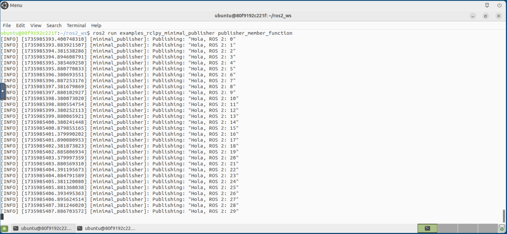
### Ejercicio 5: Suscriptor con callback personalizado
Para eldesarrollo de este ejercicio se ha modificado el código `subscriber_member_funciton.py` del repositorio de examples.

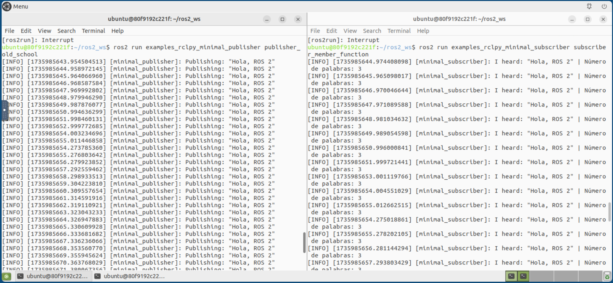
### Ejercicio 6: Publicador y suscriptor con QoS en ROS 2
Para este ejercisio, si ha construido un paquete `qos_demo_pkg` que contiene el código aportado en el enunciado para publicar mensajes en el topic `durable_topic` y recibir mensajes del topic `volatile_topic`. Los mensajes publicados en este último topic se generan desde la terminal siguiendo los pasos:

```bash
cd ~/ros2_ws
ros2 topic pub /volatile_topic std_msgs/String "{data: 'Mensaje en volatile_topic'}"
```


### Ejercicios en ROS 2: Colas de Topics y Gestión Multihilo
Para el desarrollo de esta práctica se ha creado un directorio `ej1/tails_threads` en cuyo interior están los paquetes de C++ y Phyton.

En una primera parte, se nos pide crear un publicador y un suscriptor quesea capaz de procesar los mensajes en ambos lenguajes de programación. Además, ajustamos el tamaño de las colas `queue_size` y los tiempos de sleep de los callback para estudiar el composrtamiento de los nodos suscriptores cuando procesan los mensajes de forma lenta. 

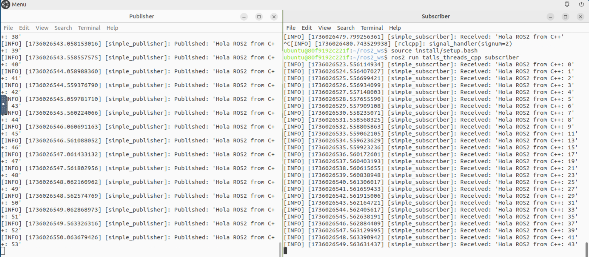
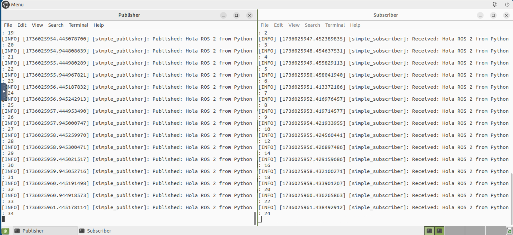
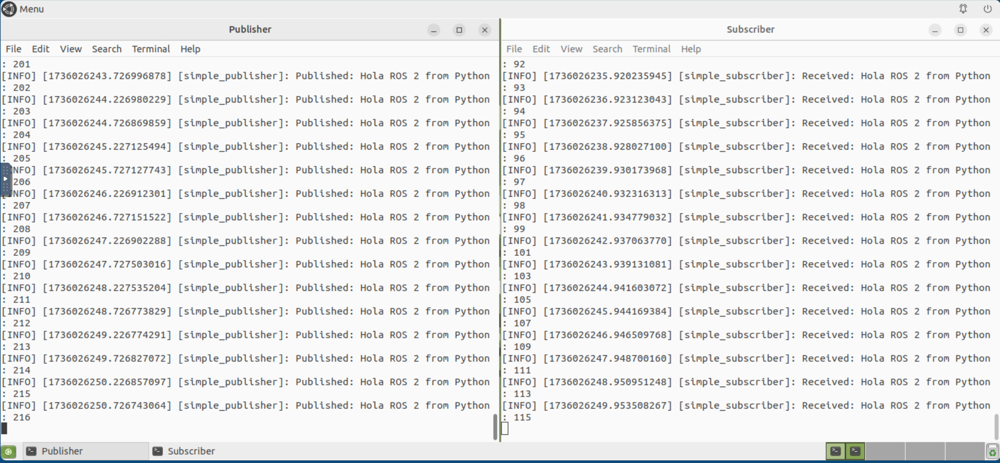

En las dos primeras imágenes, la configuración de los publisher y subscriber es la misma en ambos lenguajes, por eso vemos como el procesamiento es análogo, en ambos perdemos mensajes como era de esperar. Sin embargo, como tenemos una cola de 10 en el suscriber, decidimos aumentar esta a 100, para que sea capaz de adaptarse mejor al procesamiento y no perder mensajes aunque finalemente, los perdemos de todos modos, solo que los perdemos más tarde, es decir, cuando la cola de los 100 primero elementos se completa de imprimir, en ese punto volvemos a perder información. Con estos resultados vemos lo importante que son tanto el tamaño de las colas como los sleep a la hora de procesar información y más aún, lo relevante que puede significar tomar una buena configuración.

En una segunda parte, se nos pide usar el *MultiThreadedExecutor* para gestionar multiples callback simultaneamente. Para esto, creamos un nodo que se suscribe a varios topics simultáneamente, empleando *executor* multihilo y que además, es capaz de lanzar varios publicadores que envien mensajes a los opics correspondientes. 

Ejemplo en C++:
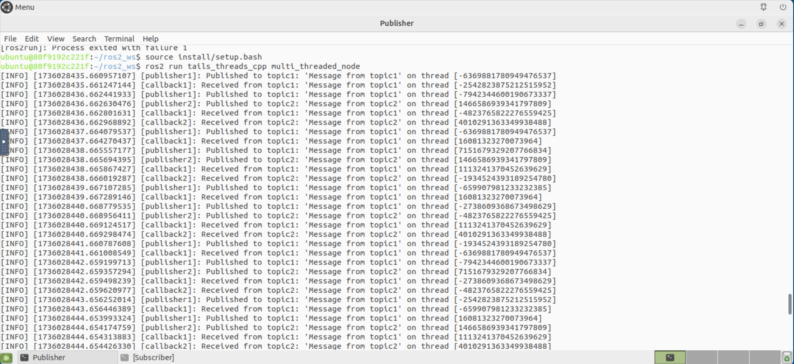
Ejmeplo en Python:


Podemos apreciar en amabas situaciones como el nodo es capaz de procesar los callbacks sin bloquearse. Recordemos que hay un *delay* de publicación de un segundo, por lo que a los dos segundos, se superponen correctamente en el procesamiento gracias al procesamiento multihilo.

## Ejercicio 2 - Suscripción a Topics en ROS 2 desde la Línea de Comandos (CLI)
En ROS 2, QoS (Quality of Service) es un conjunto de configuraciones que determina cómo se transmiten y gestionan los mensajes entre los nodos en un sistema distribuido. Estas configuraciones permiten ajustar aspectos como la confiabilidad, la persistencia de los mensajes, la capacidad de la cola y otros parámetros que afectan el comportamiento de la comunicación.

Durante este ejercicio vamos a emplear el siguiente comando para publicar un mensaje en el topic `examples_topic`

```bash
# Terminal example_topic:
ros2 topic pub /example_topic std_msgs/String "{data: 'Mensaje en example_topic'}"
```

### 2.1 Suscripción básica
El siguiente comando permite suscribirse al topic `example_topic` empleando valores predeterminados de QoS. 

```bash
ros2 topic echo /example_topic 
```

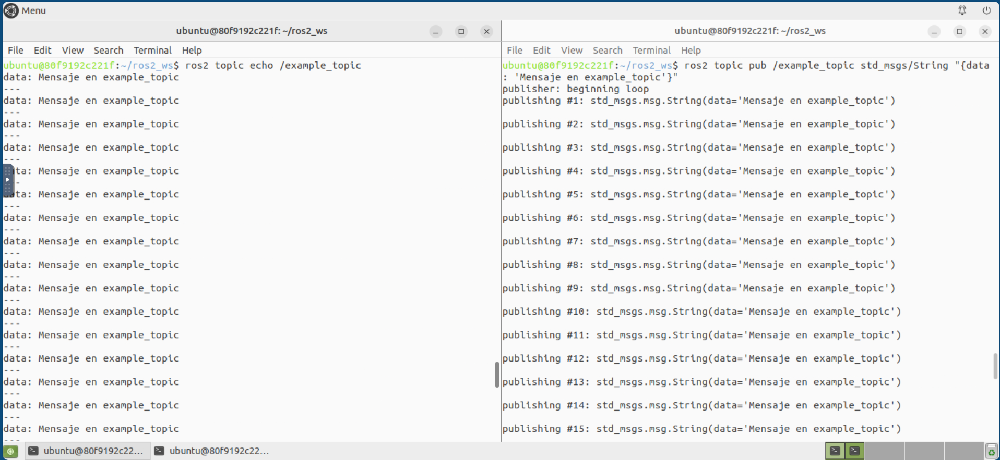
### 2.2 Configuraciones avanzadas de QoS

**2.2.1. Histórico de mensajes (History)**

Controla cuántos mensajes se almacenan en la cola:

- keep last (predeterminado): Solo almacena un número limitado de mensajes.
- keep all: Almacena todos los mensajes en la memoria.
Ejemplo para almacenar todos los mensajes:
```bash
ros2 topic echo /example_topic --qos-history keep_all
```
**2.2.2. Profundidad de la cola (Depth)**

Define el tamaño máximo de la cola de mensajes. Si se alcanzan los límites, los mensajes más antiguos serán descartados.

Ejemplo para limitar la cola a 10 mensajes:
```bash
ros2 topic echo /example_topic --qos-depth 10
```
**2.2.3. Confiabilidad (Reliability)**

Controla cómo se entregan los mensajes:

- Reliable: Garantiza la entrega de mensajes (puede introducir mayor latencia).
- Best effort: Entrega los mensajes lo más rápido posible, pero sin garantizar la entrega.
Ejemplo de confiabilidad garantizada:
```bash
ros2 topic echo /example_topic --qos-reliability reliable
```
Ejemplo de entrega sin garantía:
```bash
ros2 topic echo /example_topic --qos-reliability best_effort
```
**2.2.4. Durabilidad (Durability)**

Configura si los mensajes son persistentes:

- Volatile (predeterminado): Solo recibe mensajes publicados mientras el suscriptor está activo.
- Transient local: Recibe mensajes publicados incluso antes de que el suscriptor se conecte.
Ejemplo para mensajes persistentes:
```bash
ros2 topic echo /example_topic --qos-durability transient_local
```
### 2.3 Combinaciones de parámetros QoS

Puedes combinar múltiples configuraciones QoS en un solo comando.

Ejemplo:
```bash
ros2 topic echo /example_topic --qos-reliability reliable --qos-history keep_last --qos-depth 5
```
Este comando configura:
- Confiabilidad como reliable.
- Histórico limitado a los últimos 5 mensajes.
### 2.4 Configuraciones adicionales de QoS

**2.4.1. Tiempo de vida de los mensajes (Lifespan)**

Define cuánto tiempo un mensaje permanece válido antes de ser descartado.

Ejemplo para que los mensajes sean válidos por 5 segundos:
```bash
ros2 topic echo /example_topic --qos-lifespan 5s
```
**2.4.2. Latencia máxima permitida (Deadline)**

Especifica la latencia máxima permitida entre publicaciones. Si no se publica un mensaje dentro de este tiempo, se considera un incumplimiento.

Ejemplo para una latencia máxima de 1 segundo:
```bash
ros2 topic echo /example_topic --qos-deadline 1s
```
**2.4.3. Evitar conflictos de QoS**

Si hay conflictos entre las configuraciones de QoS del publicador y el suscriptor, puedes forzar la conexión utilizando:
```bash
ros2 topic echo /example_topic --qos-override
```
### 2.5 Monitoreo de topics y QoS
Para inspeccionar la configuración de QoS de un topic y su conectividad, se puede utilizar:
```bash
ros2 topic info /example_topic --verbose
```

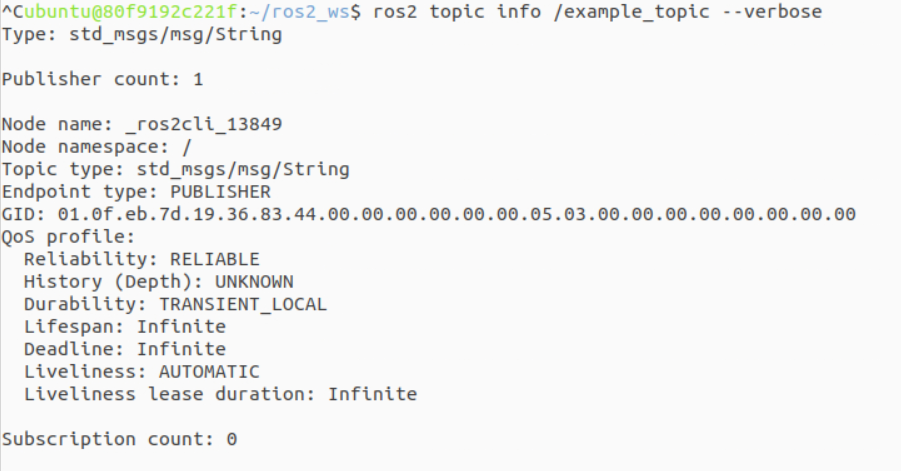

## Ejercicio 3 - Gestión de Concurrencia y Callbacks en ROS 

Estos ejercicios permiten comprender cómo manejar colas de topics y gestionar tareas concurrentes en ROS 2. La capacidad de manejar múltiples callbacks mediante executors multihilo mejora significativamente la eficiencia y flexibilidad en sistemas robóticos distribuidos.

### Ejercicio 1: Implementación de Publicador y Suscriptor con Grupos de Callbacks

Objetivo: Comprender cómo los grupos de callbacks afectan la ejecución concurrente de tareas en ROS.

Creamos un paquete de pyhton y recordemos que el código podemos revisarlo dentrod e la carpeta paquetes/ej3/double_talker_listener.

```bash
cd /ros2_ws/src/ej3
ros2 pkg create --build-type ament_python double_talker_listener --dependencies rclpy std_msgs
ros2 run double_talker_listener double_talker
```
La correcta ejecución de nuestro nodo la podemos ver a continuación.
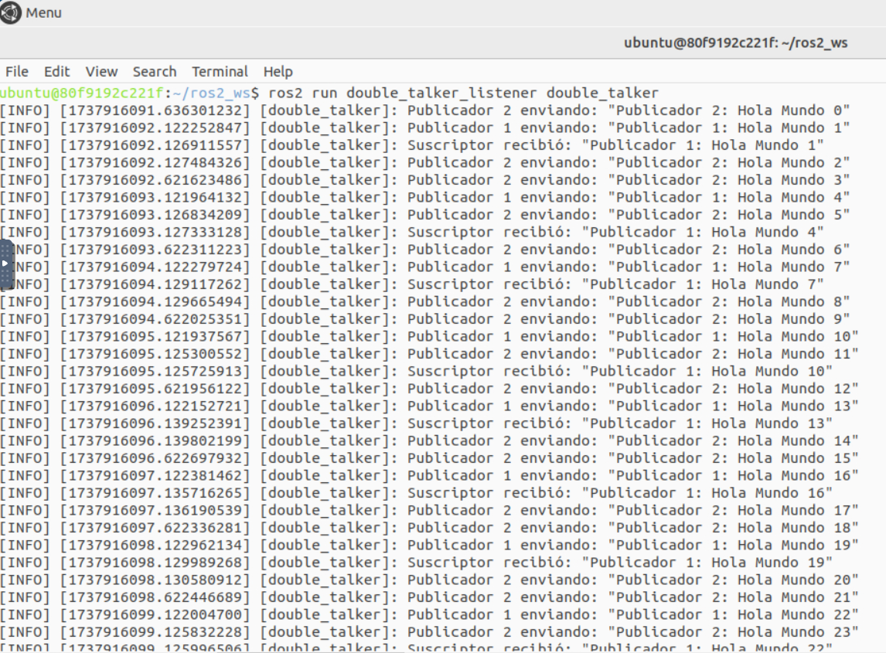

En nuestro código, tenemos un nodo llamado DoubleTalker que incluye dos publicadores y un suscriptor. Además, los publicadores están asignados con un `MutuallyExclusiveCallbackGroup` y el suscriptor `ReentrantCallbackGroup`.

El mero hecho de asignar a los publicadores un `MutuallyExclusiveCallbackGroup` nos permite la concurrencia pese a tener dos temporizadores. De este modo, se consigue que no interfieran entre sí. Cabe destacar que los callbacks no se ejecutan en paralelo sino que primero se ejecuta el publicador 1 con intervalo de 1 segundo y posteriormente el publicador 2 con intervalo de 0.5. Ambos publicadores están garantizados de no ejecutarse al mismo tiempo, lo que puede ser útil si tienes alguna lógica interna que no debe ejecutarse en paralelo, como operaciones críticas o acceso exclusivo a recursos. 

Supongamos que el suscriptor está usando un ReentrantCallbackGroup. Este grupo permite que los callbacks del suscriptor se ejecuten de manera concurrente con otros callbacks de otros grupos, sin bloqueo. En nuestro caso, tenemos un siscriptor que puede recibir varios mensajes de varios publicadores (aunque solamente está suscrito a uno como nos dice el anunciado) y procesarlos de forma paralela y eficiente, sin bloquearse mutuamente con los publicadores.
### Ejercicio 2: Composición de Multiples Nodos en un solo proceso

Objetivo: Aprender a ejecutar múltiples nodos dentro de un mismo proceso utilizando un ejecutor de un solo hilo.

Para este ejemplo, hemos empleado directamente el archivo composed.py del repositorio de refencia.

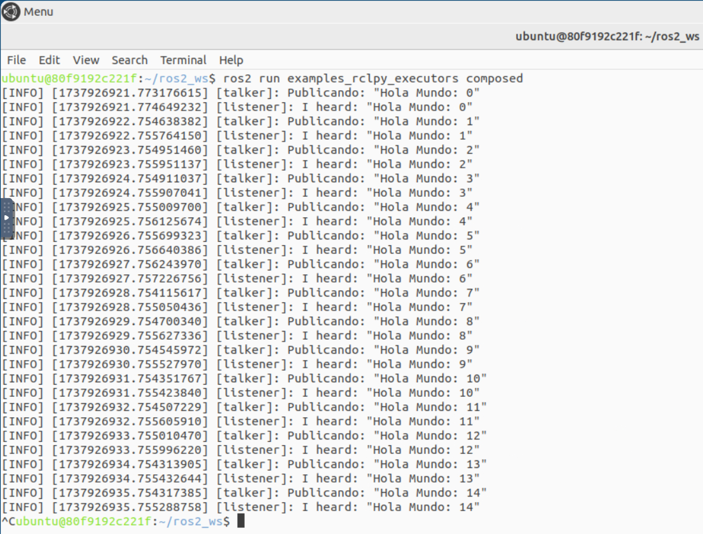

Se emplea `SingleThreadedExecutor`, que procesa todos los callbacks en un único hilo tanto el Publisher como el Listerner. Los callbacks se encolan y ejecutan secuencialmente en el orden que se activan, sin paralelismo. 

La comunicación es vía tópicos ROS 2. Talker publica en un tópico con publisher_.publish(). Listener se suscribe al mismo tópico, y su callback listener_callback() se dispara al recibir mensajes.

Cuando Talker publica un mensaje, el mensaje se envía al middleware. El executor de Listener detecta el mensaje pendiente, lo encola, y ejecuta su callback cuando llega su turno.
### Ejercicio 3: Implementación de un nodo que combina publicador y suscriptor.

Para este ejercicio, crearemos un nodo que actue simultaneamente como publicador y suscriptor. Además, emplearemos grupos de callbacks y ejecutores para asegurar que las operaciones de publicación y siscripción no interfieran entre sí.

```Python
import rclpy
from rclpy.node import Node
from rclpy.callback_groups import MutuallyExclusiveCallbackGroup
from rclpy.executors import MultiThreadedExecutor
from std_msgs.msg import String

class PubSubNode(Node):
    def __init__(self):
        super().__init__('pub_sub_node')

        self.sub_cb_group = MutuallyExclusiveCallbackGroup()
        self.timer_cb_group = MutuallyExclusiveCallbackGroup()

        self.publisher = self.create_publisher(String, 'output_topic', 10)

        self.subscription = self.create_subscription(
            String,
            'input_topic',
            self.sub_callback,
            10,
            callback_group=self.sub_cb_group
        )

        self.timer = self.create_timer(
            1.0,  
            self.timer_callback,
            callback_group=self.timer_cb_group
        )

    def sub_callback(self, msg):
        self.get_logger().info(f'Recibido: "{msg.data}"')
        rclpy.spin_once(self, timeout_sec=2)  
        
        respuesta = String()
        respuesta.data = f'Procesado: {msg.data}'
        self.publisher.publish(respuesta)
        self.get_logger().info('Mensaje procesado publicado')

    def timer_callback(self):
        msg = String()
        msg.data = 'Mensaje periódico'
        self.publisher.publish(msg)
        self.get_logger().info('Mensaje periódico publicado')

def main(args=None):
    rclpy.init(args=args)
    nodo = PubSubNode()

    # Usar MultiThreadedExecutor para manejar múltiples grupos de callbacks
    ejecutor = MultiThreadedExecutor()
    ejecutor.add_node(nodo)

    try:
        ejecutor.spin()
    except KeyboardInterrupt:
        pass
    finally:
        nodo.destroy_node()
        rclpy.shutdown()

if __name__ == '__main__':
    main()
```

## Ejercicio 4 - Creación de un Servicio en ROS 2 para Contar Vocales

Este ejercicio nos permite explorar como funcionan los servicios en ROS2, desde la definición del servidor y el cliente hasta la implementación de un tipo de mensaje personalizado.

Para el correcto desarrollo de la práctica hemos seguido el siguiente tutorial: https://www.youtube.com/watch?v=RJFoM-vnDJo

Primero se crea y verifica una interfaz personalizada que contiene el tipo de mensaje personalizado `StringToInt.srv`. Para esto, seguimos los siguientes pasos:
```bash
# Creamos el paquete con soporte para definir las interfaces personalizadas en ROS 2. El paquete usará CMAKE.
ros2 pkg create custom_interfaces --build-type ament_cmake
# Colconeamos y sourceamos para vverificar si la interface está bien definida
colcon build
source install/setup.bash
ros2 interface show count_vowels/srv/StringToInt
# string string
# ---
# int32 integer
```
En esta segunda parte, se crea el paquete del cliente-servidor.
```bash
# Se crea un paquete llamado count_vowels que utiliza Python como lenguaje principal para el cliente y servidor ROS 2.
ros2 pkg create count_vowels --build-type ament_python --dependencies rclpy custom_interfaces
# Más detalles del paquete en la carpeta ./paquetes
colcon build
source install/setup.bash
# Lanzamos primero el servicio
ros2 run count_vowels count_vowels_server
# Lanzamos el cliente en otro terminal
ros2 run count_vowels count_vowels_client
```

En reusmen, Se crea un tipo de mensaje personalizado en ROS 2 y secrean dos nodos. El nodo servidor recibe la palabra que le llega del cliente, calcula el número de vocales en la palabra y devuelve el número de vocales como respuesta. El nodo cliente envia la palabra al servidor y recibe el número de vocales como

El resultado que obtenemos es:

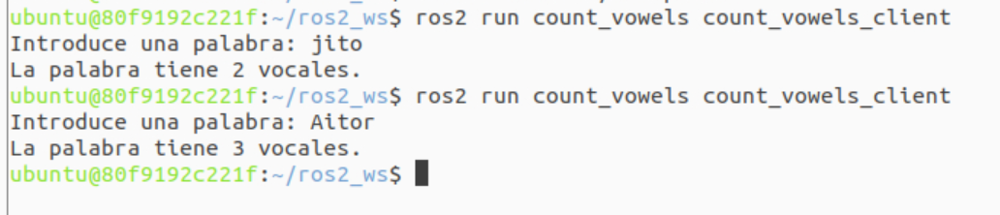
