# YARP

[Docker](#docker) <br>
[Visión general y procesos básicos](#visión-general-y-procesos-básicos) <br>
[Ejercicio 1 - Comandos básicos de YARP en la linea de comandos](#ejercicio-1---comandos-básicos-de-yarp-en-la-linea-de-comandos) <br>
[Ejercicio 2 - Uso de Puertos en YARP](#ejercicio-2---uso-de-puertos-en-yarp) <br>
[Ejercicio 3 - BufferedPort en YARP](#ejercicio-3---bufferedport-en-yarp) <br>
[Ejercicio 4 - Tiempo real en YARP](#ejercicio-4---tiempo-real-en-yarp) <br>
[Ejercicio 5 - Multihilo en YARP](#ejercicio-5---multihilo-en-yarp) <br>
[Ejercicio 6 - Relación entre YARP, ROS y ROS 2](#ejercicio-6---relación-entre-yarp-ros-y-ros-2)

## Docker 

Para el desarrollo de eta práctiva vamos a usar un condenedor con el middleware Yarp. Para esto, seguimos el siguiente repositorio: [Link](https://github.com/fjrodl/icub-gazebo-grasping-sandbox). Tenemos la opción de usar Gitpod, pero preferimos tener en local nuestro contenedor. para esto, seguimos los siguientes pasos:

```powershell
# Se crea un volumen para la persistencia de datos
docker volume create midd_yarp

# Se ejecuta el contenedor con la imagen de interés y la persistencia de datos.
docker run -it --name midd_yarp `
  -v midd_yarp:/home/gitpod/midd_yarp `
  -p 6080:6080 `
  --user gitpod `
  ghcr.io/robotology/icub-gazebo-grasping-sandbox:latest

# Iniciamos el entorno VNC dentro del contenedor
start-vnc-session.sh

# Se clona e instala el proyecto
git clone https://github.com/robotology/icub-gazebo-grasping-sandbox.git
cd icub-gazebo-grasping-sandbox
cmake -S . -B build
cmake --build build/ --target install
```

Accedemos al entorno gráfico `http://localhost:6080` para acceder a la interfaz gráfica. Dentro, se ejecuta el experimento montado con el siguiente comando:

```bash
icub-grasp.sh
```

Desde el entorno gráfico se tiene:

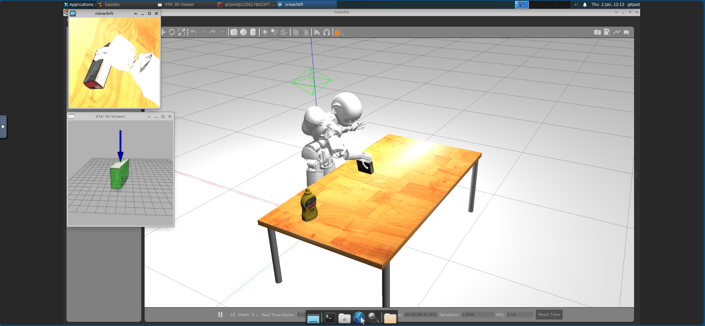

**<span style="color: red;">IMPORTANTE:</span>** Para volver a iniciar el contenedor es necesario ejecutar desde el terminal:
```powershell
# Iniciar el contenedor 
docker start -ai midd_yarp

# Iniciamos el entorno VNC dentro del contenedor
start-vnc-session.sh
```

## Visión general y procesos básicos

YARP (Yet Anhother Robot Platform) es un middleware de código abierto diseñado para facilitar la comunicación modular y 
distribuida en sistemas robóticos. s. Proporciona herramientas y bibliotecas para conectar componentes de software que 
interactúan en un entorno robótico, permitiendo que diferentes módulos se comuniquen entre sí de manera eficiente, 
independientemente de su ubicación o lenguaje de programación.

El YARP Server es un componente central de YARP que actúa como un servidor de nombres. Su principal función
es gestionar y registrar los nombres y ubicaciones de los puertos en una red distribuida, permitiendo que los módulos
de un sistema robótico se conecten de manera flexible e independiente de su ubicación física.
Por lo tanto, el proceso inicial que se debería seguir para realizar cada uno de los ejemplos de la práctica es el siguiente:

1. Inicia el servidor de nombres de YARP con el comando: $yarpserver

En el interior de nuestro contenedor Docker, hemos creado una carpeta llamada `yarp_exercises` como espacio de trabajo. Dentro de esta, se recogen todos los programas que desarrollemos durante esta práctica y un CMmakeList.txt
 que nos vas a permitir construir el proyecto. Dentro de esta misma carpeta, seguimos los siguientes pasos:

 ```bash
# Creamos una carpeta de compilación
mkdir build
cd build

# Configuramos y complamos el proyecto con cmake
cmake ..
make

# Para la ejecución de los programas podemos lanzar 
./sender
 ```

 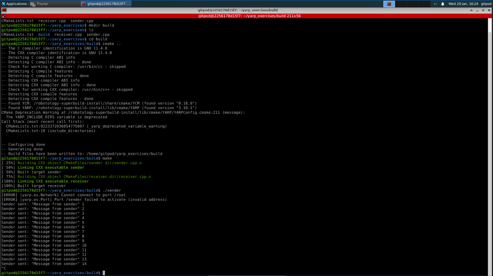

## Ejercicio 1 - Comandos básicos de YARP en la linea de comandos

A continuación se exponen una lista de comandos de YARP, acompañados de una breve descripción sobre su utilidad y propósito. El listado completo: [Link](https://www.yarp.it/latest/group__yarp.html)

### Verificación entorno de YARP

- Para verificar la instalación y configuración de YARP usamos el comando:
```bash
yarp check
```
Comprueba que las bibliotecas necesarias están disponibles y que el entorno de red es funcional.

- El comando `yarp conf <hostname><port>` configura la dirección y el puerto del servidor de nombres YARP en la máquina local.
Se emplea para establecer comunicación conm el servidor YARP en una red distribuida.

### Iniciar y verificar el servidor de nombres

- Para iniciar el servidor de nombres de YARP, el cual es fundamental para gestionar la comunicación entre diferentes procesos y puertos usamos el comando:
```bash
yarpserver
```
- Para mostrar la dirección y el puerto del servidor de nombres que está en uso, permitiendo verificar su estado y ubicación en la red, usamos el comando:
```bash
yarp where
```

### Crear y manupular puertos

Los puertos son la base delacomunicación en YARP. Estos comandospermitencrearlos, conectarlos y gestionarlos:

- Para crear un puerto de escritura llamado `example/writer`, que pemite enviar mensaje a otros puertos conectados.
```bash
yarp write /example/writer
```
- Para crear un pueto de lectura llamado  `example/reader`, que puede recibir mensajes desde un puerto de escritura conectado:
```bash
yarp read /example/reader
```
- Si queremos establece una conexión entre el puerto de escritura `example/writer` y el puerto de lectura `example/reader`, permitiendo la transmisión de datos.
```bash
yarp connect /example/writer /example/reader
```
- Si por el contrario, queremos romper la conexión entre los puertos y detener la transmisión de datos:
```bash
yarp disconnect /example/writer /example/reader
```
- El comando `yarp name list` nos permite verificar que puertos están disponibles y sus conexiones.

### Pruebas y diagnosticos

Estos comandos ayudan a verificar el funcionamiento y la conectividad de los puertos:

- Para comprobar la conexión entre dos puertos:
```bash
yarp connect /example/writer /example/reader
# Con el siguiente comando comprobamos si el puerto está activo y accesible en la red:
yarp ping /example/reader
```
- Para inspeccionar el estado de un puerto, mostrando cualquier mensaje recibido:
```bash
yarp read /example/reader
```
- Para enviar mensajes a un puerto:
```bash
yarp write /example/writer
```

### Manipulación avanzada de puertos

- Para crear un puerto anónimo de escritura, util para pruebas rápidas, pero que puede causar problemas porque no tinee un nombre asignado en els ervidor de nombres usamos:
```bash
yarp write --anon
```
- El siguiente comando registra un nombre para un puerto en el servidor de nombres, facilitando su identificación y conexión con otros puertos
```bash
yarp name register /my/port
```
- Para eliminar el registro del puerto del servidor de nombres creado anteriormente y que no sea accesible bajo ese nombre:
```bash
yarp name unregister /my/port
```

### Limpiar el estado del servidor de nombres

- Reiniciar el servidor de nombres eliminando todos los registros de puertos y copnexiones activas:
```bash
yarp clean
```

### Comandos útiles para redes distribuidas

- Si queremos verificar la conectividad con otor servidor de nombre en una red distribuida, asegurando que se pueda conectar con otros dispositivos:
```bash
yarp check --remote <hostname>:<port>
```
- Para transferir la gestioón de un puerto a otro servidor (útil en sistemas distribuidos):
```bash
yarp name reconfigure <port> <new-server>
```

### Configuración básica de puertos desde la linea de comandos

En este punto y, con el objeto de familiarizarnos con la creación y manupulación de puertos en YARP:

```bash
# Iniciamos el servidor de nombres de YARP
yarpserver

# Se crea un puerto en la terminal llamado /sender
yarp write /sender

# Se crea otro puerto en una nueva terminal llamado /receiver
yarp read /receiver

# Se conectan ambos puertos
yarp connect /sender /receiver

# Envía mensajes desde el puerto /sender y verifica que se reciben en receiver.
```

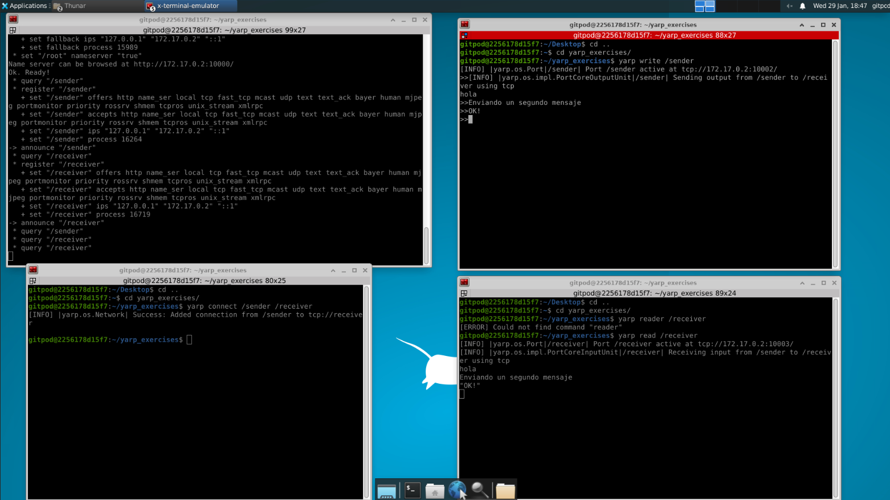

### Preguntas

- ¿Qué sucede si intentas enviar un mensaje antes de conectar los puertos?
El mensaje no se recibe porque no hay una ruta establecida entre los puertos.

- ¿Cómo se desconectan los puertos desde la terminal?
```bash
yarp disconnected /sender /receiver
```
- Prueba a crear un segundo puerto de lectura (/receiver2) y conéctalo al puerto de escritura. ¿Ambos lectores reciben el mensaje?
Si creamos un segundo puerto de lectura, y no se conecta con el puerto de escritura, no veremos ningún mensaje. Sin embargo, si lo conectamos, de igual modo que ocurre con el otro puerto de lectura, podremos ver el mensaje leido por el terminal. La representación clara de este ejemplo se representa en la siguiente imagen.


## Ejercicio 2 - Uso de Puertos en YARP

Dentro de nuestro directorio de trabajo `yarp_exercises` definimos dos nuevos programas `custom_sender.cpp` y `custom_receiver.cpp`. El primer programa crea un puerto de escritura `/custom_sender`, envia un mensaje y cierra el puerto cuando ha enviado un total de 50 mensaje. El segundo, crea un puerto de lectura `/receiver` y muestra los mensajes recibidos.

Para ejecutarlo seguimos el siguiente procedimiento:

```bash
# Primero compilamos con cmake
cd yarp_exercises/build/
cmake ..
make

# Iniciamos YARP server en un terminal
yarpserver

# En otro terminal ejecutamos el programa que envía mensaje
./custom_sender

# En otro terminal ejecutamos el programa que recibe mensajes
./custom_receiver

# No hace falta que se conecten manualmente si lanzamos sender primero y receiver después porque el receiver conecta los puertos via código. Si lanzamos primero el receiver y luego el sender, será necesario conectarlos manualmente. 
```

Los resultados obtenidos son:

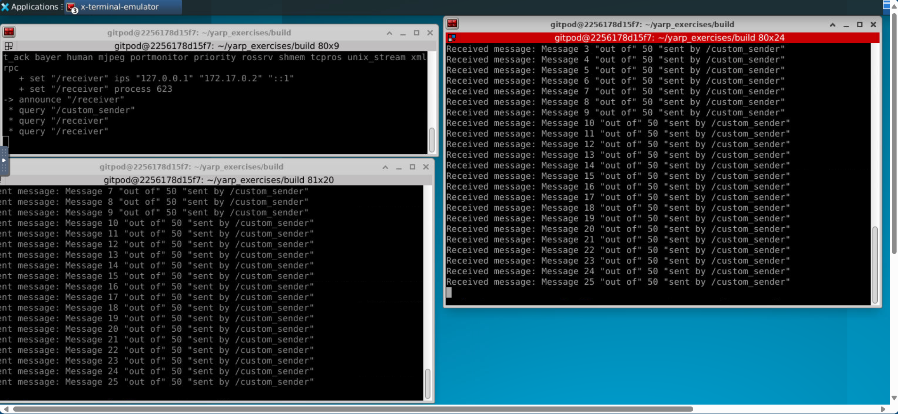

- ¿Qué sucede si los puertos no se conectan?


El nodo receptor `/custom_receiver` no recibirá ningún mensaje a través de su puerto `/receiver` y el nodo productor seguirá enviando mensajes, pero estos no llegarán a ningún destinatario.

- ¿Cómo podrías modificar el nodo receptor para manejar multiples mensajes con diferentes formatos?

Podemos modificar el receptor para leer mensajes continuos en un bucle y diferenciar los tipos de datos.

```c
#include <yarp/os/Network.h>
#include <yarp/os/Bottle.h>
#include <yarp/os/Port.h>
#include <iostream>

using namespace yarp::os;

int main(int argc, char* argv[]) {
    YARP_UNUSED(argc);
    YARP_UNUSED(argv);

    Network yarp;
    Port input;
    input.open("/receiver");

    Network::connect("/custom_sender", "/receiver");

    while (true) {
        Bottle bot;
        if (input.read(bot)) { 
            std::cout << "Received message: " << bot.toString() << std::endl;

            // Analiza el mensaje y ejecuta acciones según su contenido
            if (bot.get(0).isString() && bot.get(0).asString() == "Command") {
                std::cout << "Processing command: " << bot.get(1).asString() << std::endl;
            } else if (bot.get(0).isInt32()) {
                std::cout << "Received an integer: " << bot.get(0).asInt32() << std::endl;
            }
        }
    }

    input.close();
    return 0;
}
```

### Conexión directa entre puertos en YARP

En este ejercicio se demuestra cómo conectar un puerto de escritura (writer) con un puerto de lectura (reader)
directamente desde el código, sin necesidad de usar el comando `yarp connect`. Esto se logra utilizando el método `addOutput` del puerto de escritura.

- ¿Cuáles son los pasos realizados?

Hemos creado un programa con el código `custom_auto_connect.cpp`. 

Inicialización de la red YARP:
- `Network yarp;` se crea un objeto de tipo `Network` para inicializar la red de YARP. Este objeto es necesario para establecer la comunicación entre los puertos.

Creación de puertos de escritura y lectura:
- Se crean dos puertos de tipo `BufferedPort<Bottle>`: uno para escribir (`writerPort`) y otro para leer (`readerPort`).

Apertura de los puertos con nombres específicos:
- Los puertos se abren con nombres específicos utilizando los métodos `open()` de cada puerto: `writerPort.open("/example/writer")` y `readerPort.open("/example/reader")`.

Conexión directa entre puertos:
- Se conecta el puerto de escritura con el de lectura usando `writerPort.addOutput("/example/reader")`. Este método permite que el puerto de escritura envíe mensajes directamente al puerto de lectura, sin necesidad de usar el comando `yarp connect`.

Envío de un mensaje:
- Se prepara y limpia el mensaje utilizando `writerPort.prepare()` y `message.clear()`. Luego, se agrega un mensaje al objeto `Bottle` usando `message.addString("Hello, YARP!")` y se escribe con `writerPort.write()`.

Lectura del mensaje en el puerto de lectura:
- El mensaje se lee desde el puerto de lectura utilizando `readerPort.read()`. Si se recibe un mensaje, se imprime en consola usando `std::cout`.

Cierre de los puertos:
- Finalmente, los puertos se cierran usando `writerPort.close()` y `readerPort.close()`.


Los pasos para poder ejecutar el código son:

```bash
# Configuramos el proyecto con cmake y lo compilamos
cd yarp_exercises/build/
cmake ..
make

# Ejecutamos nuestro programa
./custom_auto_connect
```

Los resultados obtenidos:

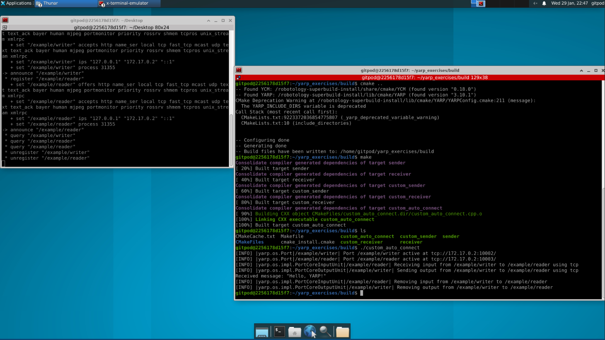

- ¿Cuál es la diferencia entre `Network::connect` y `Port::addOutput`?

`Network::connect`: Se utiliza para establecer una conexión entre dos puertos de YARP (por ejemplo, entre un puerto de lectura y uno de escritura). Este método se usa para definir explícitamente una conexión entre dos puertos en la red de YARP y generalmente se invoca desde la terminal o desde el código.

`Port::addOutput`: Se usa para conectar un puerto de escritura a un puerto de lectura dentro del mismo código, sin necesidad de usar el comando `yarp connect`. Es un método del puerto de escritura para indicar a qué puerto de lectura se enviarán los mensajes.

- ¿Cómo cambiarías los `std::cout` por mensajes de logging?

Si tenemos en cuenta la documentación oficial de YARP para el sistema de logging [LINK](https://www.yarp.it/latest/yarp_logging.html), podemos integrar su sistema de logging directamente en el código. YARP ofrece un mecanismo de logging propio mediante la clase yarp::os::Logger

```c
#include <yarp/os/Network.h>
#include <yarp/os/BufferedPort.h>
#include <yarp/os/Bottle.h>
#include <yarp/os/Logger.h>
#include <iostream>

using namespace yarp::os;

int main() {
    // Inicializa la red de YARP
    Network yarp;

    // Crear puertos de escritura y lectura
    BufferedPort<Bottle> writerPort;
    BufferedPort<Bottle> readerPort;

    // Abrir los puertos con nombres específicos
    writerPort.open("/example/writer");
    readerPort.open("/example/reader");

    // Conectar el puerto de escritura con el de lectura directamente
    writerPort.addOutput("/example/reader");

    // Crear un objeto logger
    Logger log;

    // Enviar un mensaje desde el puerto de escritura
    Bottle& message = writerPort.prepare();
    message.clear();
    message.addString("Hello, YARP!");
    writerPort.write();

    // Utilizar el sistema de logging de YARP para registrar el envío del mensaje
    log.info("Message sent: Hello, YARP!");

    // Leer el mensaje en el puerto de lectura
    Bottle* receivedMessage = readerPort.read();
    if (receivedMessage != nullptr) {
        // Utilizar el sistema de logging de YARP para registrar el mensaje recibido
        log.info("Received message: " + receivedMessage->toString());
    }

    // Cerrar los puertos
    writerPort.close();
    readerPort.close();

    return 0;
}
```

## Ejercicio 3 - BufferedPort en YARP

### Objetivo: 
Escribir un programa que use puertos BufferedPort para enviar y recibir mensajes.

### Definición de BufferedPort: 
Un BufferedPort es un tipo especial de puerto en YARP que combina las funcionalidades
de un puerto normal con un mecanismo interno de almacenamiento en búfer. Este búfer permite que
los datos enviados o recibidos sean almacenados temporalmente, lo que facilita la comunicación asíncrona y evita
perdidas de datos en caso de que el puerto remoto no este disponible temporalmente.

En el código `buffered_port.cpp` se expone un ejemplo básico que emplea `BufferedPort`. La ejecución del mismo se expone en la imagen que se muestra a continuación.

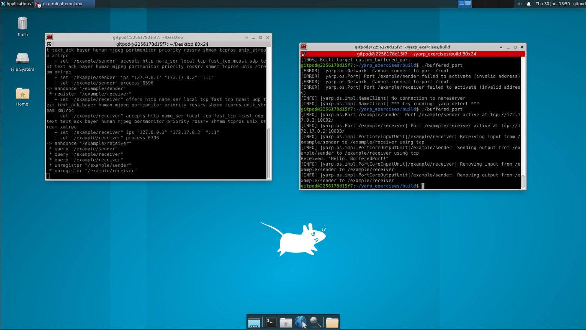

Además, se nos pide que hagamos una descripción del programa y enumeremos los elementos más característicos.

- **Descripción del programa**

Se inicializa la red YARP, se crean los puertos, se abren los puertos, se conectan los puertos, se envian y reciben mensajes, se cierran puertos y, 
al finalizar, ambos puertos son cerrados con senderPort.close() y receiverPort.close() para liberar recursos.

- **Elementos más característicos**

Se emplea `BufferedPort`, la comunicación es asíncrona lo que significa que no es necesario que el receptor esté listo exactamente cuando el emisor envia el mensaje porque se almacena en el búfer
hasta que sea leido. El uso de `Bottle` permite el envio de mensajes de diferentes tipos.

### Ejercicio Propuesto: Uso de BufferedPort en Comunicación Simultánea

Para el desarrollo de este ejercicio  se ha definido un programa donde tenemos dos `BufferedPort` que actuan como productores (producer 1 y producer 2), que además, 
envian de manera periódica mensajes a un único puerto receptor (consumer). Este puerto recibe y nos muestra todos los mensajes enviados por el publicador.

Respecto al código anterior, hay varias diferencias clave. Para la simulación de dos productores, se crean dos hilos empleando `std::thread`,
cada hilo ejecuta un bucle infinito que prepara, escribe y envia mensajes periódicamente. Tenemos conexiones múltiples para que los productores puedan enviar emnsajes al mismo consumidor.
Tenemos un bucle infinito para que el consumidor sea capaz de leer de forma constante los mensajes del puerto y los imprima cuando los recibe.
Finalmente, se cierran los puertos y se espera a que los hilos terminen.

La correcta ejecución del código desarrollado para está práctica (`custom_buffered_port.cpp`) se adjunta el la siguiente imagen:

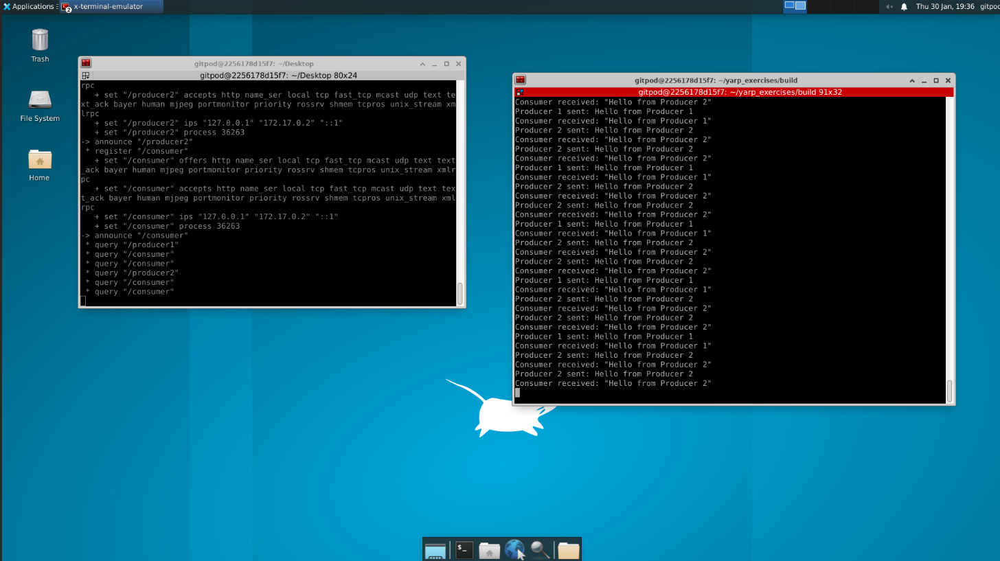

## Ejercicio 4 - Tiempo real en YARP

### Objetivo: El objetivo del ejercicio es diseñar un programa en YARP que permita gestionar el comportamiento por
defecto en las colas de mensajes.

### Descripción: El soporte para aplicaciones en tiempo real en YARP permite gestionar de manera eficiente los datos
que fluyen entre diferentes componentes del sistema. En particular, cuando se requiere que los módulos trabajen con
información siempre actualizada (como en sistemas de control o procesamiento de sensores), YARP proporciona
herramientas útiles para manejar este comportamiento.
En este ejemplo, se dividen los programas de sender y receiver en dos componentes separados, utilizando
BufferedPort para la comunicación. El receptor aprovecha el método setStrict() para garantizar que únicamente 
se procese el mensaje más reciente, descartando los mensajes más antiguos en caso de que el productor
genere datos a una velocidad superior a la del consumidor.

- **Por defecto**, `BufferedPort` almacena los mensajes en un búfer, permitiendo que el receptor procese los mensajes en orden **FIFO (First In, First Out)**.
  
  Esto significa que los mensajes se manejan en el mismo orden en que fueron recibidos. El receptor lee y procesa cada mensaje en el orden en que llegaron al puerto.

- **Cuando se activa `setStrict(true)`**, el receptor ignora cualquier mensaje que no haya sido procesado antes de que llegue un nuevo mensaje. Esto asegura que el consumidor siempre maneje los datos más recientes.

### Ejercicio

- **Puerto del emisor (/sender):**

El puerto del emisor `/sender`, genera y envia mensajes a alta velocidad, es decir, un mensaje cada 200 ms. Se emplea un `BufferedPort` para
almacenar mensajes antes de ser enviados. Cada mensaje contiene una cadena fija y un contador incremental que refleja el numero del mensaje enviado. 

- **Puerto del receptor (/receiver):**

El puerto receptor `/receiver`, recibe y procesa los mensajes enviados desde el purto `/sender`. De igual modo, usamos `bufferedPort` para recibir los mensajes.
El receptor puede configurarse para manejar los mensajes de manera estricta o no, empleando `setstrict()`. Además, se añade un delay para realentizar la recepción de mensajes.

- **Frecuencia de envío:**

El emisor envía mensajes cada 200ms. Esta alta tasa de transmisión puede generar problemas si el receptor no puede procesar los mensajes tan rápido como se reciben, lo que justifica el uso de setStrict() para garantizar que siempre se manejen los datos más recientes.

- **Ventajas y desventajas de setStrict():**

El método setStrict() ofrece la ventaja principal de asegurar que el receptor siempre procese los datos más recientes.
Sin embargo, una desventaja significativa es que cualquier mensaje anterior que no haya sido procesado a tiempo será descartado, lo que podría resultar en la pérdida de información importante en contextos donde todos los datos tienen valor, no solo los más recientes. 

Para `setStrict(bool)` a true:

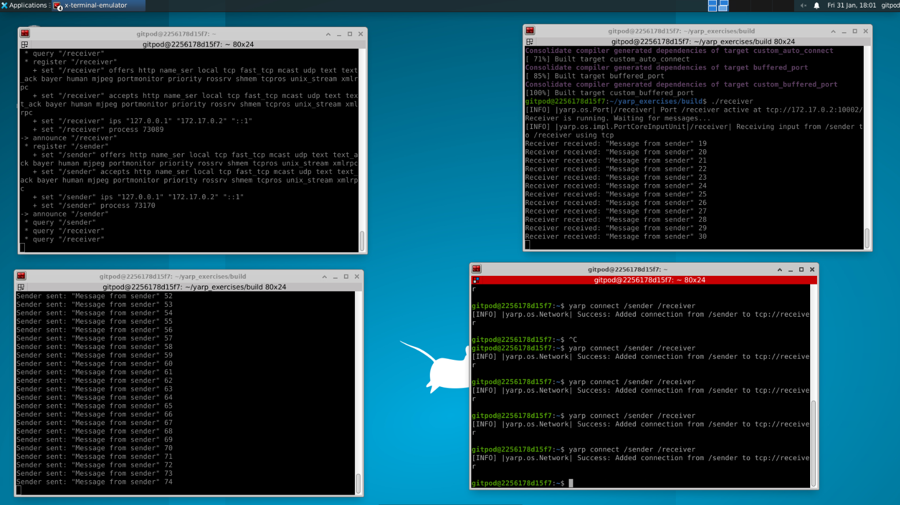

Para `setStrict(bool)` a false:

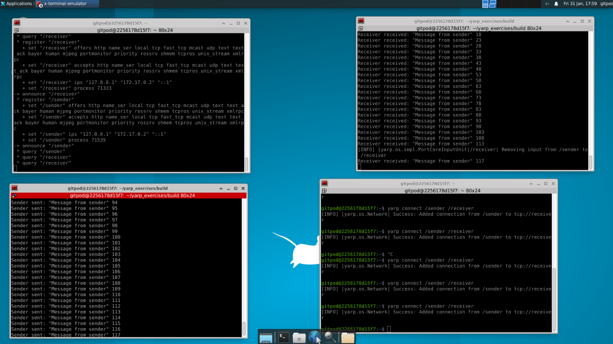

## Ejercicio 5 - Multihilo en YARP

### Objetivo  

El objetivo del ejercicio es diseñar un programa en YARP que permita trabajar y probar la clase `Thread` en YARP y C++.  

### Descripción  

El multihilo es un componente clave en aplicaciones robóticas modernas, y YARP ofrece una infraestructura flexible para implementar este enfoque. En un sistema robótico, múltiples tareas suelen ejecutarse de manera simultánea, como procesar datos de sensores, controlar actuadores y comunicarse con otros módulos.  
La capacidad de utilizar múltiples hilos permite que estas tareas se ejecuten de forma concurrente, lo que mejora la eficiencia y reduce la latencia en la respuesta del sistema. En YARP, la clase `yarp::os::Thread` permite implementar hilos personalizados con control detallado sobre su ejecución, lo que resulta fundamental para sistemas distribuidos y en tiempo real.  
El soporte multihilo en YARP también facilita la integración y coordinación entre módulos que dependen de diferentes tasas de actualización o priorización. Por ejemplo, un hilo puede encargarse de capturar datos de un sensor de cámara a alta frecuencia, mientras que otro hilo procesa esos datos y los envía a través de un puerto.  
Además, YARP garantiza una integración sencilla entre hilos y su sistema de comunicación basado en puertos, lo que permite diseñar arquitecturas escalables y robustas. Esta capacidad resulta especialmente útil en proyectos donde los módulos deben funcionar de manera independiente pero mantenerse coordinados mediante comunicación interna o externa.  

### Ejercicio 1 (Opcional)

Este código se encuentra dentro de la carpeta de yarp_exercises, con el nombre de `multihilo.cpp`. La ejecución se muestra a continuación:

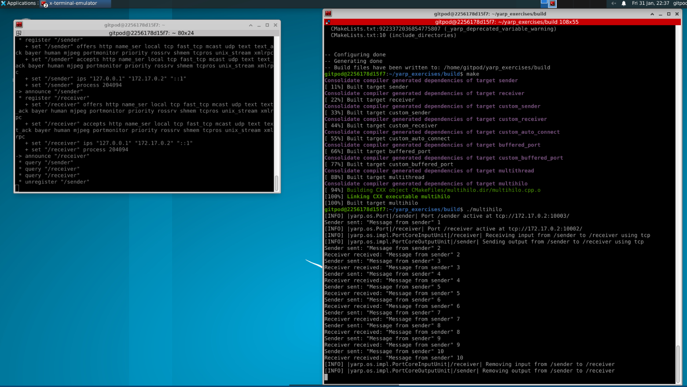

### Ejercicio 2

Para este ejercicio hemos desarrollado un programa en C++ (`multithread.cpp`) para YARP, de tal manera que tenemos dos productores y un único consumidor. Para ROS, hemos reutilizado el ejemplo 4 desarrollado en la práctica 4 de ROS.

El resultado de ejecutar nuestro programa `multithread.cpp` es:

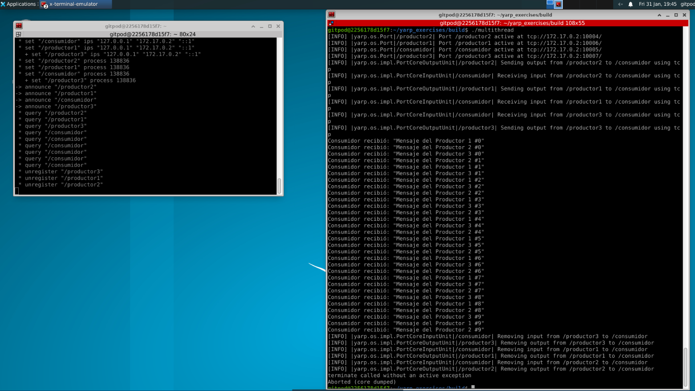

### Preguntas 

- **¿Cuál es más sencillo de implementar y por qué?**

ROS es más sencillo de implementar para tareas de multihilos y comunicación entre nodos porque presenta una gran comunidad y documentación, la integración es sencilla y, atendiendo a nuestro ejercicio, `ros::AsyncSpinner` gestion automáticamente la concurrencia entre múltiples hilos; lo que lo hace más sencillo de integrar.

- **¿Cómo manejarías condiciones de carrera en YARP?**

Para evitar condiciones de carrera en YARP, podemos utilizar mecanismos de sincronización como mutexes (yarp::os::Mutex) y barreras (yarp::os::Semaphore). Estos mecanismos aseguran que solo un hilo acceda a recursos compartidos a la vez.

- **¿Qué sistema es más eficiente para alta concurrencia?**

ROS es más eficiente en alta concurrencia debido a su arquitectura basada en `ros::AsyncSpinner` y su capacidad para escalar mejor en sistemas distribuidos.

## Ejercicio 6 - Relación entre YARP, ROS y ROS 2

Hemos implementado un ejemplo de comunicación básica para poder comprobar el comportamiento entre YARP, ROS y ROS 2. Los resultados de la ejecución se exponen a continuación.

Ejemplo con YARP:


Ejemplo con ROS:

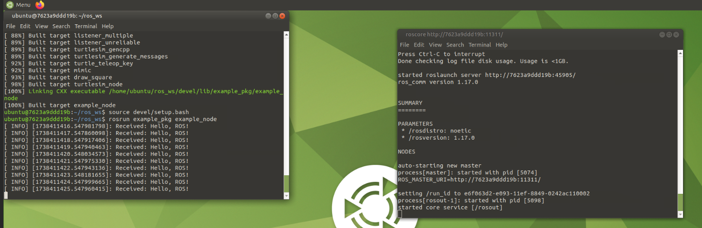

Ejemplo con ROS 2:

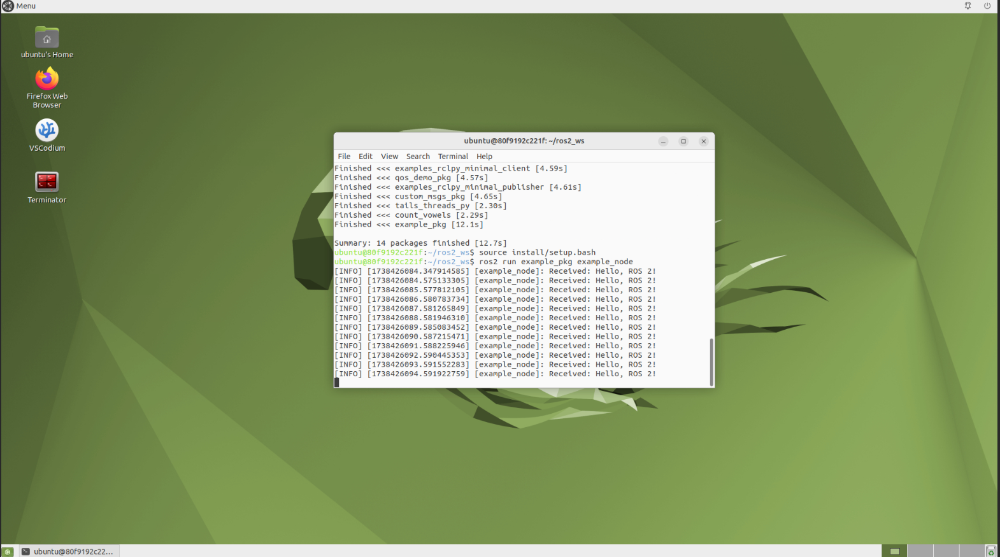

### Análisis

- **Configuración inicial**

*YARP*

Se inicializa la red con `Network yarp;`. Se abren los puertos con `BufferedPort<Bottle>` y se conectan con `Network::connect`. 

*ROS*

Se inicia con `ros::init(argc, argv, "example_node");`. Se emplea `ros::NodeHandle` para mejorar la comunicación. Además, los publisher y ssuscriber se crean de forma explícita en el sistema de nombres de ROS.

*ROS 2*

S inicializa con `rclcpp::init(argc, argv);`. Los nodos se crean con `rclcpp::Node::make_shared("example_node");`. Emplea DDS para la comunicación.

- **¿Cómo gestionan los mensajes?**

*YARP*

Usa `BufferedPort<Bottle>` para enviar y recibir mensajes. Se envian los mensajes con los métodos `prepare()` y `write()`. Los mensajes se almacenan internamente y se leen con `read()`.

*ROS*

Emplea `publisher.publish()` para enviar mensajes y `subscriber.callback()` para recibir los mensajes de forma asíncrona. Se emplea una cola `Queue Size` para almacenar los mensajes entrantes y salientes.

*ROS 2*

Similar a ROS, pero con la configuración avanzada de QoS. Se usa `rclcpp::spin_some()` para procesar eventos de forma flexible.

- **Comportamiento con mensajes perdidos o retrasados**

*YARP*

BufferedPort almacena mensajes hasta que son leídos. Si un mensaje llega tarde, se mantiene en el buffer hasta ser consumido.

*ROS*

Si el Queue Size es 0, los mensajes se descartan si no hay un suscriptor activo. No tiene garantía de entrega una vez que se publica un mensaje.

*ROS 2*

History QoS permite configurar la persistencia de mensajes.
Reliability QoS puede asegurar entrega garantizada (RELIABLE) o mejor esfuerzo (BEST_EFFORT).
Durability QoS permite que los mensajes sigan disponibles para nuevos suscriptores.

**Conclusión**

YARP es útil en sistemas modulares con requisitos de conexión flexible.

ROS 1 es más simple, pero tiene limitaciones en la gestión de calidad de servicio.

ROS 2 ofrece más configurabilidad con DDS, haciéndolo ideal para aplicaciones en tiempo real y sistemas distribuidos.